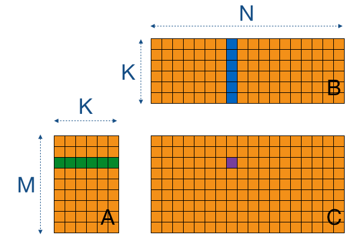
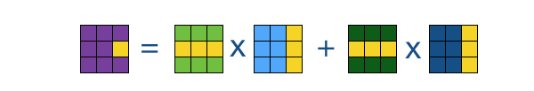
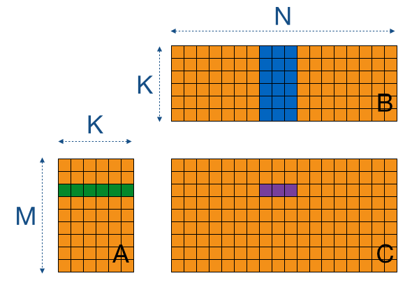
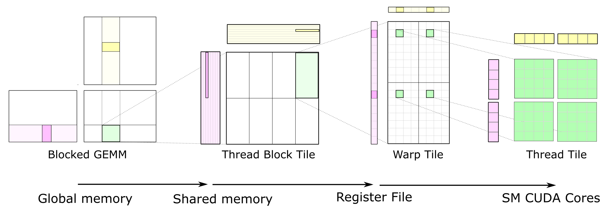

# Primer on GEMM

GEMM stands for GEnerak Matrix Multiplication, but more on that later. This document is the study on GEMMs and how optimisation works at the core level. The information is a summary from:
1. `google/gemmlowp`: [link](https://github.com/google/gemmlowp/blob/master/doc/design.md)
2. Tutorial on OpenCL SGEMM: [link](https://cnugteren.github.io/tutorial/pages/page1.html)
3. [wikipedia](https://en.wikipedia.org/wiki/Basic_Linear_Algebra_Subprograms)
4. An Engineers guide to gemm: [blog](https://petewarden.com/2015/10/25/an-engineers-guide-to-gemm/)
5. CUTLASS (CUDA Templates for Linear Algebra Subroutines): [blog](https://developer.nvidia.com/blog/cutlass-linear-algebra-cuda/)
6. Youtube [Video](https://www.youtube.com/watch?v=JzNpKDW07rw) (2:56mins long)
7. LAPACK `sgemm` [documentation](https://www.netlib.org/lapack/explore-html/db/dc9/group__single__blas__level3_gafe51bacb54592ff5de056acabd83c260.html)
8. stackoverflow [answer](https://stackoverflow.com/questions/61945276/how-does-the-dimention-argument-of-sgemm-work)
9. How to optimize GEMM [wiki](https://github.com/flame/how-to-optimize-gemm/wiki), [video](https://www.youtube.com/watch?v=cKkF690TuG8)

## BLAS

Basic Linear Algebra System (BLAS) is a specification that describes low level routines for performing commong linear algebra operations such as vector additions, scalar multiplications, dot products, linear combination and matrix multiplications.

### Functionality

BLAS functionality is categorised into three routines or "levels", which are chronological in the order of definition (dates) and polynomial complexity (in all cases below: `a` is alpha and `b` is beta).

1. L1 (`axpy`): This has all the vector operations like dot products, vector norms, etc. Typical equation looks like:
```
y <- ax + y
```
2. L2 (`gemv`): This has the matrix-vector operations. Typical equation looks like this:
```
y <- aAx + y
```
3. L3 (`gemm`): This has the matrix-matrix operations. Typical equation looks like this:
```
C <- aAB + bC
```

**Optimisations and GEMM:** Since GEMM is the most commonly used version, most of the effort in optimisation has been put here:

1. Recursively calculating `C`: This is the main reason behind introducing `b` beta.
2. Decomposing `A` & `B` in blocks: Decomposition requiresa special case of `b=1` which has many implementations to optimise for, therby elimination of one multiplication of `C`. The decomposition allows for better locality of reference (address wise) and so can improve by taking advantage of cache.

## Storage

Computers store values in a long memory and not in blocks, so even though you might see a `10x10` matrix the values are actually stores in a single/different 100 locations. "Row-major" is when the values are stored row by row and column major is when they are stored column by column.
```
If A looks like this:

| 0 | 1 | 2 |
| 3 | 4 | 5 |
| 6 | 7 | 8 |

Row Major:    | 0 | 1 | 2 | 3 | 4 | 5 | 6 | 7 | 8 |
Column Major: | 0 | 3 | 6 | 1 | 4 | 7 | 2 | 5 | 8 |
```

## Typical GEMM Operation

In any GEMM operation we cannot load all three matrices (`A`, `B` and `C`) into the L2/L1 cache. Moreover the algorithmic complexity (`O(n^3)`) grows faster than memory complexity (`O(n^2)`), also once the data is loaded in the memory (RAM then L2 then L1) the operations are fast enough to ignore. Thus as long as we work in the registers we won't have a problem. A typical GEMM code looks like this:
```
allocate(some_lhs_L2_block);
allocate(some_rhs_L2_block);
for (some_lhs_L2_block) {
  pack(some_lhs_L2_block);
  for (some_rhs_L2_block) {
    pack(some_rhs_L2_block);
    for (some_lhs_sub_block in some_lhs_L2_block) {
      for (some_rhs_sub_block in some_rhs_L2_block) {
        kernel(some_lhs_sub_block, some_rhs_sub_block);
      }
    }
  }
}
```

## Tutorial

This is a single doc version of tutorial for implementing `SGEMM` (single precision GEMM) using OpenCL on Nvidia K80 GPU. So we start off with the problem, given `m=k=n=4096`, we want to perform a matrix multiplication. The matrix multiplication looks as follows:



**Kernel #1:** So in the first iteration we write the brute force code for this:
```
for m=0,M {
    for n=0,N {
        float acc = 0.0;
        for k=0,K {
            acc += A[k*M + m] * B[n*K + k];
        }
        C[n*M + m] = acc;
    }
}
```

This is a terrible implementation because we keep trying to access memory that can be off-chip (causes OOM in DL libraries) and this is a very expensive process, but hey this is a starting point. In order to perform a `MxN` operation we need `MxNxKx2` loads and `MxN` stores.


**Kernel 2:** What we know is that we do not need to keep the entire thing on memory and instead just a few sections that we want to process thereby increasing the speed. So we can cache the subblocks, in this process of "tiling" we store a few block on the chip as follows:


And even here you can see in order to fill a certain value we need to calculate only a few columns and values as before 


**Kernel 3:** Now if you think about the process above, we need to load parts of same column twice and rows twice and add those twice, that is 6 operations in total (only 1 is important `fma (A, B)`):
```
load(A_tile_1)
load(B_tile_1)
fma (A_tile_1, B_tile_1)
load(A_tile_2)
load(B_tile_2)
fma (A_tile_2, B_tile_2)
```

So we can optimise by getting more out of each thread (also reducing the thread count). We can now load an equivalent data but instead of tiling all we load one row of A (reducing memory access to it to 1) and loading the entire B block together (still doing tiled multiplication), but now we only access B so the `load(B_tile)` is the only operation other than `fma`.



**Kernel 4:** No special trick here, instead we utillise the Nvidia's vector storage. Now there are no optimisations for vector operations on Nvidia GPUs they do provide vectore storage types.

**I don't understand what's going on any more, feel free to [read](https://cnugteren.github.io/tutorial/pages/page7.html)**. But you should now get the idea behind optimisations and in particular the memory laoding piece. In rest of the kernel's the authors continues to take advantage of these features.

### From Nvidia

This [blog](https://developer.nvidia.com/blog/cutlass-linear-algebra-cuda/) from Nvidia about CUTLASS explains how their GEMM implementation works.



It perform the following steps (from the left):

1. Each thread block computes `C += A*B` in the highlighted section, which is further partitioned into warps. Highlighted part in the green, second from left. The pink one has shape `BlockItemsK x BlockItemsY` and yellow has shape `BlockItemsX x BlockItemsY`.
2. These pink (rhs) and yellow (lhs) blocks are performed across multiple warps. The parameters BlockItems{X,Y,K} are compile-time constants that the programmer specifies to tune the GEMM computation for the target processor and the aspect ratio of the specific GEMM configuration (e.g. M, N, K, data type, etc.).
3. By now you can see that each Thread Block Tile is actaully broken into sequences (A fragment and B fragment) that cover each warp tile. The size of the fragments is super small in order to maximise the compute intensity relative to the amount of data loaded from te shared memory, thereby avoiding shared memory bandwidth as a bottleneck.
4. These sequences are now broken into individual values in the array as seen in the third picture and expanded as in the fourth picture. Now all the parallel operations on the threads cannot access the same element at the same time, so a strategy is designed to pick as many different values as possible to maximise core utilisation.

## Convolution and GEMM

Convolution are the most common operations in deep learning, however the amount of data that is called in it makes it very loading and saving intensive. We use `im2col` method to pre fetch the data and load it in the memory, however in this approach we need to keep copies of the same location on the grid. A single convolution operation looks as follows :
```
define input[C,H,W]    # C,H,W = height, width, input channels
define kernel[M,K,K,C] # M = output channel
define output[M,H,W]   # K = kernel size

for h=1,H {
  for w=1,W {
    for o=1,M {
      sum = 0;
      for x=1,K {
        for y=1,K {
          sum += input[i,h+y,w+x] * kernel[o,x,y,i];
        }
      }
      output[o,w,h]=sum;
    }
  }
}
```

Now as I mentioned we can pre fetch the values that are to be operated on, and these values are called the patches and the storing matrix is known as the patch matrix. Using strides requires construction of different patch matrices as below:
```
 (Input Matrix)
+--+--+--+--+--+
|a1|a2|a3|a4|a5|
+--+--+--+--+--+
|b1|b2|b3|b4|b5|
+--+--+--+--+--+
|c1|c2|c3|c4|c5|
+--+--+--+--+--+
|d1|d2|d3|d4|d5|
+--+--+--+--+--+

(Patch Matrix of 3x3)    (Stride 1 patch matrix)
+--+--+--+--+--+--+--+        +--+--+--+--+
|0 |0 |a0|a1|a2|a3|a4|        |0 |a0|a2|a4|
+--+--+--+--+--+--+--+        +--+--+--+--+
|0 |a0|a1|a2|a3|a4|0 |        |0 |a1|a3|0 |
+--+--+--+--+--+--+--+        +--+--+--+--+
|a0|a1|a2|a3|a4|0 |0 |        |a0|a2|a4|0 |
+--+--+--+--+--+--+--+        +--+--+--+--+
|0 |0 |b0|b1|b2|b3|b4|        |0 |b0|b2|b4|
+--+--+--+--+--+--+--+        +--+--+--+--+
|0 |b0|b1|b2|b3|b4|0 |        |0 |b1|b3|0 |
+--+--+--+--+--+--+--+        +--+--+--+--+
|b0|b1|b2|b3|b4|0 |0 |        |b0|b2|b4|0 |
+--+--+--+--+--+--+--+        +--+--+--+--+
|0 |0 |c0|c1|c2|c3|c4|        |0 |c0|c2|c4|
+--+--+--+--+--+--+--+        +--+--+--+--+
|0 |c0|c1|c2|c3|c4|0 |        |0 |c1|c3|0 |
+--+--+--+--+--+--+--+        +--+--+--+--+
|c0|c1|c2|c3|c4|0 |0 |        |c0|c2|c4|0 |
+--+--+--+--+--+--+--+        +--+--+--+--+
```

Now notice that if the first patch (first `3x3` matrix) is stored in the third column in left matrix and on second column on the right matrix. This is becuase of the column major in GEMM ops (GEMM ops com from Fortran and uses column major, C/C++ uses row major also called column minor).


## `sgemm` Doc

`pytorch` uses [CUDABlas](https://github.com/pytorch/pytorch/blob/master/aten/src/ATen/cuda/CUDABlas.cpp) for acceleration on Nvidia GPUs and FB_GEMM or LAPACK for CPU Blas [support](https://github.com/pytorch/pytorch/blob/master/aten/src/ATen/native/CPUBlas.cpp). Here is `sgemm` [documentation](https://www.netlib.org/lapack/explore-html/db/dc9/group__single__blas__level3_gafe51bacb54592ff5de056acabd83c260.html).
```
sgemm (
  character                TRANSA,
  character                TRANSB,
  integer                  M,
  integer                  N,
  integer                  K,
  real                     ALPHA,
  real, dimension(lda,*)   A,
  integer                  LDA,
  real, dimension(ldb,*)   B,
  integer                  LDB,
  real                     BETA,
  real, dimension(ldc,*)   C,
  integer                  LDC 
)  
```

Here is the meaning of all the arguments:
1. `TRANSA`: the operation to perform on `A`, `if TRANSA = N or n; op(A)=A` (no transpose is performed) `elif TRANSA in [T,t,C,c]; op(A) = A.T`
2. `TRANSB`: the operation to perform on `B`, `if TRANSB = N or n; op(B)=B` (no transpose is performed) `elif TRANSB in [T,t,C,c]; op(B) = B.T`
3. `M`: On entry, `M` specifies the number of rows of the matrix `op(A)` and of the matrix `C`
4. `N`: On entry, `N` specifies the number of columns of the matrix `op(B)` and of the matrix `C`
5. `K`: On entry, `K` specifies the number of columns of the matrix `op(A)` and number of rows of matrix `op(B)`
6. `ALPHA`: alpha value in the [equation 3](#functionality)
